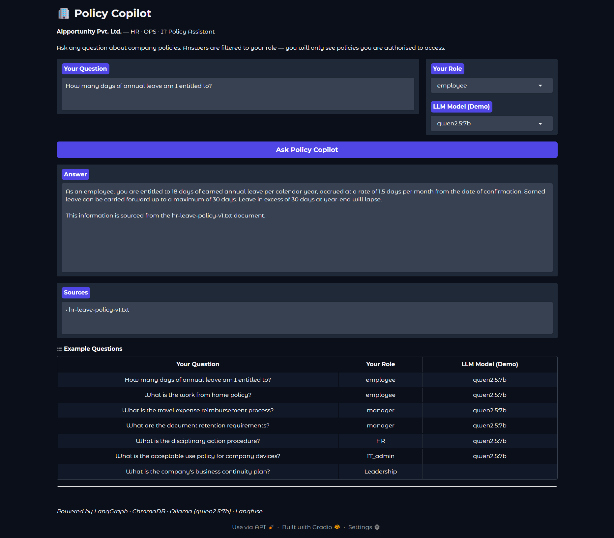
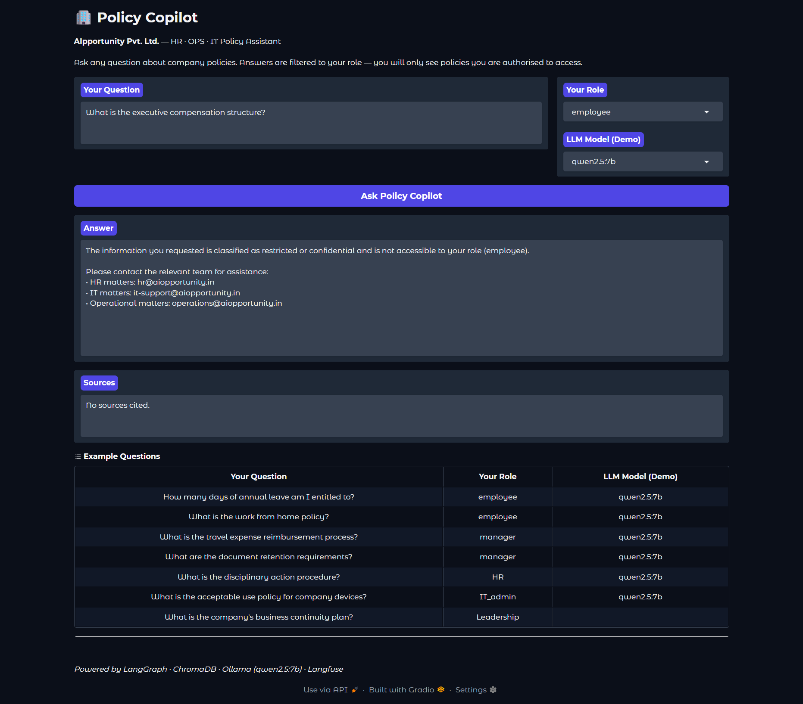
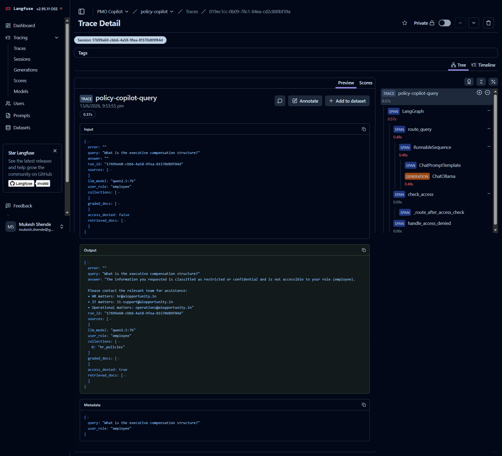

# Policy Copilot

An AI-powered policy assistant for AIpportunity Pvt. Ltd., built using LangGraph and a fully local stack. Employees, managers, and administrators can ask questions about HR, Operations, and IT policies in plain English and receive grounded, role-appropriate answers.

---

## What It Does

Policy Copilot is a Retrieval-Augmented Generation (RAG) agent that:

- Understands a question and routes it to the right policy domain (HR, OPS, or IT)
- Retrieves only the policy chunks your role is permitted to see
- Grades retrieved chunks for relevance before generating an answer
- Enforces Role-Based Access Control (RBAC) — restricted content returns a clear denial message, not a partial answer
- Logs every run to a local SQLite governance database
- Traces LLM calls to Langfuse for observability

---

## Demo

### Answering a policy question (employee role)


### RBAC in action — access denied for restricted content


### Langfuse trace showing LLM spans


---

## Roles Supported

| Role | What They Can Access |
|---|---|
| employee | General HR and OPS policies |
| manager | Employee-facing policies + management guidelines |
| HR | All HR policies including restricted procedures |
| IT_admin | All IT policies |
| Leadership | All policies including executive-level content |

---

## Tech Stack

| Layer | Technology |
|---|---|
| Agent framework | LangGraph 0.4.8 |
| Vector store | ChromaDB 1.0.9 |
| LLM + Embeddings | Ollama (qwen2.5:7b / qwen2.5:14b, nomic-embed-text) |
| UI | Gradio 5.33.0 |
| Observability | Langfuse (self-hosted) |
| Governance | SQLite with WAL mode |
| Deployment | Docker Compose → K3s |

Zero cloud dependencies. Everything runs on a homelab.

---

## Project Structure

```
policy-copilot/
├── data/
│   └── policies/          # 26 synthetic policy documents
├── docs/                  # Architecture and design notes
├── k8s/                   # Kubernetes manifests
├── src/
│   ├── agent/             # LangGraph nodes, graph, state, prompts
│   ├── governance/        # SQLite logging
│   ├── ingestion/         # ChromaDB ingestion pipeline
│   └── app.py             # Gradio UI entry point
└── tests/                 # Persona-based test harness
```

---

## Quick Start (Local)

**Prerequisites:** Python 3.12, Ollama running with `qwen2.5:7b` and `nomic-embed-text` pulled, ChromaDB data ingested.

```bash
# 1. Clone and set up environment
git clone <repo-url>
cd policy-copilot
python -m venv .venv && source .venv/bin/activate
pip install -r requirements.txt

# 2. Configure environment
cp .env.example .env   # fill in Ollama URL and Langfuse keys

# 3. Ingest policy documents
python -m src.ingestion.ingest

# 4. Launch the UI
python -m src.app
# Open http://localhost:7860
```

See `docs/architecture.md` for a full system walkthrough.

---

## Deployment

Docker Compose and K3s manifests are in `docker-compose.yml` and `k8s/`. See `k8s/README.md` for deployment steps.

---

## Built As Part Of

ADLC Bootcamp — Agent Development Lifecycle framework for building production-grade LangGraph agents from scratch.
