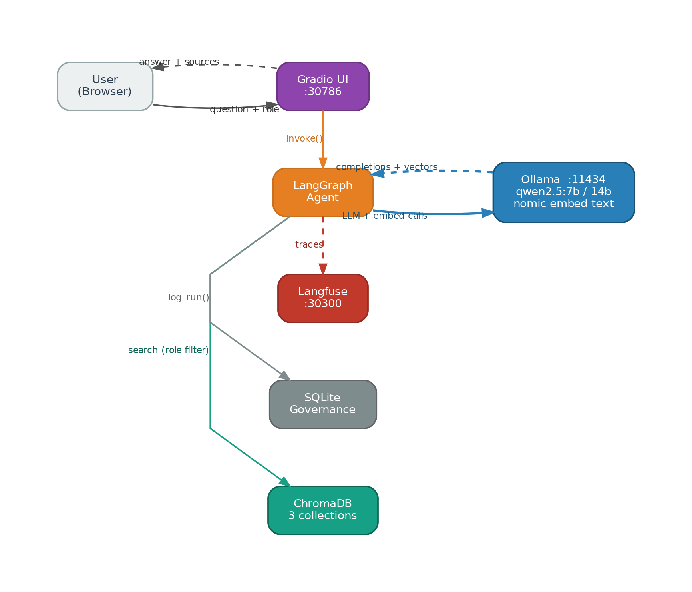
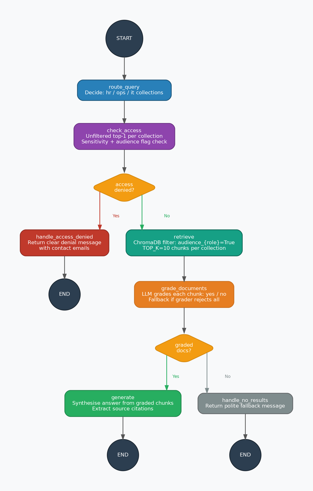
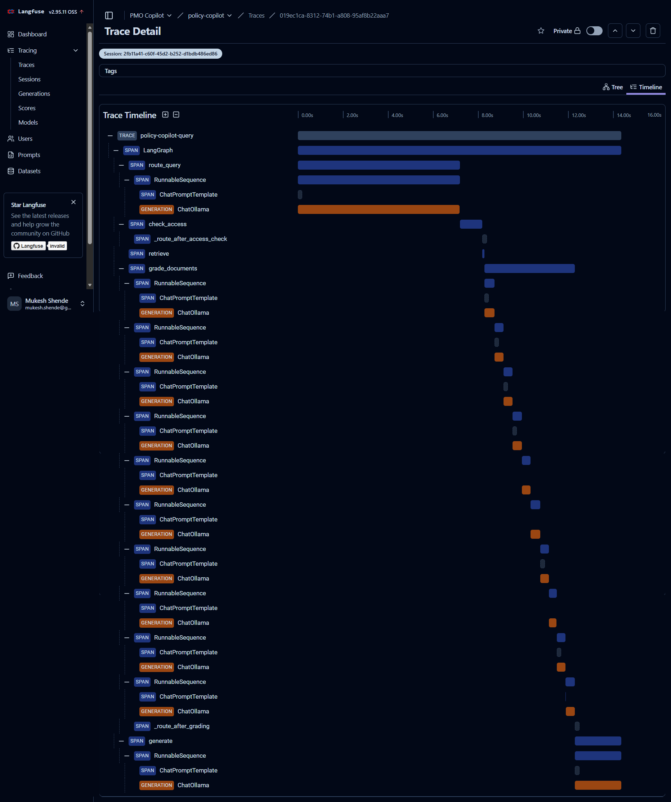

# Policy Copilot — Architecture

This document explains how Policy Copilot works end-to-end, from a user's question to a grounded, role-filtered answer.

---

## System Overview



Policy Copilot is a LangGraph-based RAG agent with five distinct processing stages. Each stage is an explicit node in a StateGraph — there is no hidden chaining or implicit flow. The entire pipeline runs locally with no cloud dependencies.

---

## Hardware Layout

```
Windows Host (192.168.1.16)          homelab5550 (192.168.1.32 — Xubuntu 24.04)
───────────────────────────          ────────────────────────────────────────────
Ollama :11434                        K3s single-node cluster
  qwen2.5:7b                           policy-copilot namespace
  qwen2.5:14b                          Gradio UI   → NodePort 30786
  nomic-embed-text                     Langfuse    → NodePort 30300
                                     ChromaDB (hostPath volume)
                                     SQLite governance DB
```

LLM and embedding inference stays on the Windows host (more RAM). Everything else runs on the Linux homelab.

---

## LangGraph Pipeline

Every user query travels through this node sequence:

```
START
  │
  ▼
route_query
  │  LLM reads the question and decides which collections to search:
  │  hr_policies, ops_policies, it_policies — or all three.
  │
  ▼
check_access
  │  Unfiltered top-1 similarity search per collection.
  │  If the best-matching document is restricted/confidential AND
  │  the user's role is not authorised → access_denied = True.
  │
  ├── (access_denied = True) ──► handle_access_denied ──► END
  │                               Returns a clear denial message
  │                               with contact emails. No content leaked.
  │
  └── (access_denied = False)
          │
          ▼
       retrieve
          │  ChromaDB similarity search with audience filter:
          │  where={f"audience_{user_role}": True}
          │  Fetches TOP_K=10 chunks per collection.
          │
          ▼
      grade_documents
          │  LLM grades each chunk yes/no for relevance to the query.
          │  Fallback: if all rejected but docs exist, use all retrieved
          │  (prevents false "no results" with strict models).
          │
          ├── (graded_docs empty) ──► handle_no_results ──► END
          │
          └── (graded_docs non-empty)
                  │
                  ▼
               generate ──► END
                  LLM synthesises answer from graded chunks.
                  Sources extracted from chunk metadata.
```

---

## Role-Based Access Control (RBAC)



Access control is enforced at two levels:

**Level 1 — check_access node (pre-retrieval gate)**
Runs an unfiltered search to find the semantically closest document. If that document is marked `sensitivity: restricted` or `sensitivity: confidential` and the user's role does not have the matching audience flag, the graph short-circuits to `handle_access_denied`. The user receives a clear message and no policy content is returned.

**Level 2 — ChromaDB audience filter (retrieval)**
Even if check_access allows a query through, retrieval applies a hard filter: `where={f"audience_{user_role}": True}`. A chunk never reaches the LLM unless it is explicitly flagged for the user's role.

Each policy document carries five boolean metadata fields set at ingestion time:

| Field | Roles it enables |
|---|---|
| `audience_employee` | employee |
| `audience_manager` | manager |
| `audience_HR` | HR |
| `audience_IT_admin` | IT_admin |
| `audience_Leadership` | Leadership |

---

## ChromaDB Schema

Three collections, one per policy domain:

| Collection | Contents |
|---|---|
| `hr_policies` | Leave, recruitment, performance, disciplinary, compensation |
| `ops_policies` | Travel, procurement, vendor, document retention, BCP |
| `it_policies` | Acceptable use, data classification, BYOD, incident response |

Documents are chunked at 500 characters with 50-character overlap. Each chunk stores: `source_file`, `sensitivity`, `domain`, and the five audience booleans.

---

## Observability



Every LLM call (router, grader ×N, generator) emits a span to Langfuse via `LangfuseCallbackHandler`. Traces are keyed by `run_id` (UUID per query) and tagged with `user_role` and `query` for filtering.

Every graph run is also logged to a local SQLite governance database (`data/governance.db`) with: `run_id`, `query`, `user_role`, `answer_length`, `sources`, `timestamp`.

---

## Key Design Decisions

**Why LangGraph over a plain LangChain chain?**
Explicit state machine — every branch (access denied, no results, grader fallback) is a named node with a clear edge. Easy to extend, easy to debug, easy to explain.

**Why local-only (no cloud)?**
Policy documents contain internal company data. Keeping inference on-premise eliminates data egress risk and demonstrates that production-grade RAG is achievable without cloud APIs.

**Why two access control layers?**
The ChromaDB filter alone is correct but invisible to users — they just get a vague "no results" message. The `check_access` node adds an explicit, honest denial with contact information, which is what a real enterprise deployment needs.
