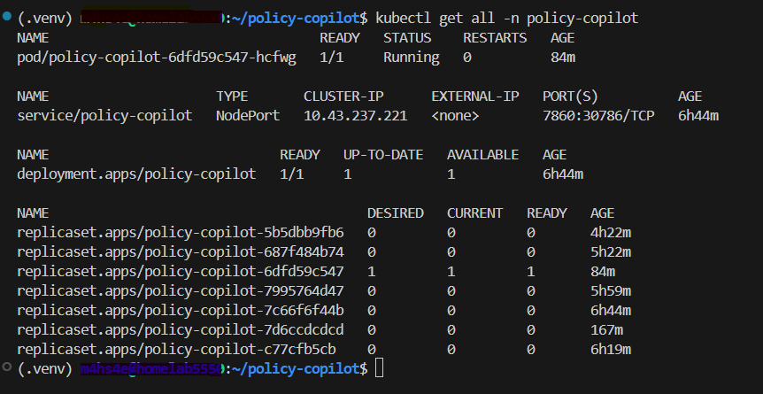

# k8s — Kubernetes Manifests

Deployment manifests for running Policy Copilot on a K3s single-node cluster.

---

## Files

| File | Purpose |
|---|---|
| `01-configmap.yml` | Environment variables (Ollama URL, model names, Langfuse host, ports) |
| `02-secret.yml` | Langfuse API keys — **not committed to git, create manually on the server** |
| `03-deployment.yml` | Pod spec — image, resource limits, hostPath volume for ChromaDB |
| `04-service.yml` | NodePort service exposing Gradio on port 30786 |

---

## Prerequisites

- K3s running on homelab5550
- `policy-copilot` namespace created
- Docker image built and imported into K3s containerd
- ChromaDB already ingested at `/home/m4hs4e/policy-copilot/data/chroma_db`
- `k8s/02-secret.yml` created manually with real Langfuse keys

---

## First-Time Deploy

```bash
# 1. Create namespace
kubectl create namespace policy-copilot

# 2. Create the secret manually (never committed to git)
cp k8s/02-secret.yml.example k8s/02-secret.yml
# Edit 02-secret.yml and fill in your Langfuse public and secret keys

# 3. Apply all manifests
kubectl apply -f k8s/01-configmap.yml
kubectl apply -f k8s/02-secret.yml
kubectl apply -f k8s/03-deployment.yml
kubectl apply -f k8s/04-service.yml

# 4. Verify pod is running
kubectl get pods -n policy-copilot

# 5. Open the UI
# http://192.168.1.32:30786
```

---

## Rebuilding After Code Changes

```bash
# On homelab5550
cd ~/policy-copilot

# 1. Build new image
docker build -t policy-copilot:latest .

# 2. Import into K3s containerd
docker save policy-copilot:latest | sudo k3s ctr images import -

# 3. Restart the pod
kubectl rollout restart deployment/policy-copilot -n policy-copilot
kubectl rollout status deployment/policy-copilot -n policy-copilot
```

---

## Key Configuration

All non-secret configuration lives in `01-configmap.yml`:

| Key | Value | Notes |
|---|---|---|
| `OLLAMA_BASE_URL` | `http://192.168.1.16:11434` | Windows host Ollama |
| `OLLAMA_LLM_MODEL` | `qwen2.5:7b` | Default LLM |
| `OLLAMA_EMBED_MODEL` | `nomic-embed-text` | Embeddings model |
| `LANGFUSE_HOST` | `http://10.43.211.110:3000` | K3s ClusterIP |
| `AVAILABLE_MODELS` | `qwen2.5:7b,qwen2.5:14b` | Controls Demo Mode dropdown |
| `GRADIO_PORT` | `7860` | Internal container port |

To add a new model to the Demo Mode dropdown, update `AVAILABLE_MODELS` in `01-configmap.yml` and run `kubectl apply -f k8s/01-configmap.yml` followed by a rollout restart. No code change needed.

---

## Resource Limits

Defined in `03-deployment.yml`:

| Resource | Limit |
|---|---|
| Memory | 1Gi |
| CPU | 1000m |

ChromaDB data is mounted from the host at `/home/m4hs4e/policy-copilot/data` — it persists across pod restarts.

---

## Screenshot



---

## Useful Commands

```bash
# Check pod status
kubectl get pods -n policy-copilot

# View live logs
kubectl logs -f deployment/policy-copilot -n policy-copilot

# Describe pod (useful for diagnosing startup failures)
kubectl describe pod -n policy-copilot

# Check all resources in namespace
kubectl get all -n policy-copilot
```
